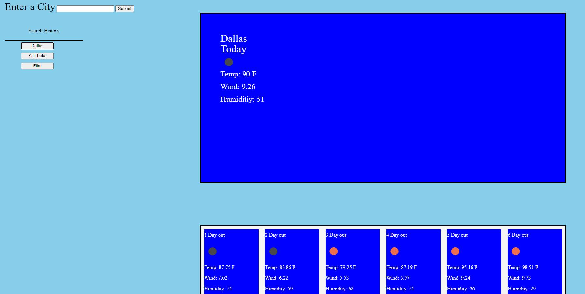

# Weather-Dashboard

## Description
This app uses the openweather.org api to get weather data and display it on a web page displays the current weather along with a addtional 6 day forcast.  the program also saves previous searches and stores them so that one can press a button to retrive info searched previously

## Installation
N/A

## Usage
  a web app for looking up weather in different locations
## Screen Shot

## Credits

README. Template Provided by codeing boot camp Full- Stack Blog. url: https://coding-boot-camp.github.io/full-stack/github/professional-readme-guide

collaberated with Mary Elenius for coding advice and debugging.
## License

N/A

